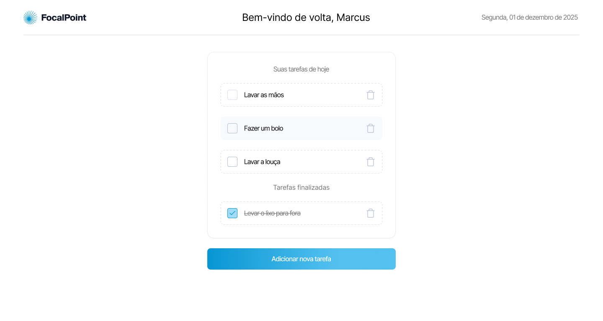

# Focal Point

## Rodando localmente

Clone o projeto

```bash
  git clone https://github.com/JoaoGuiBC/focal-point.git
```

Entre no diretório geral do projeto
```bash
  cd focal-point
```

Instale as dependências
```bash
  pnpm install
```

Rode o projeto
```bash
pnpm dev
```